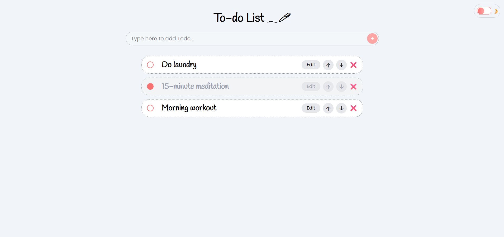
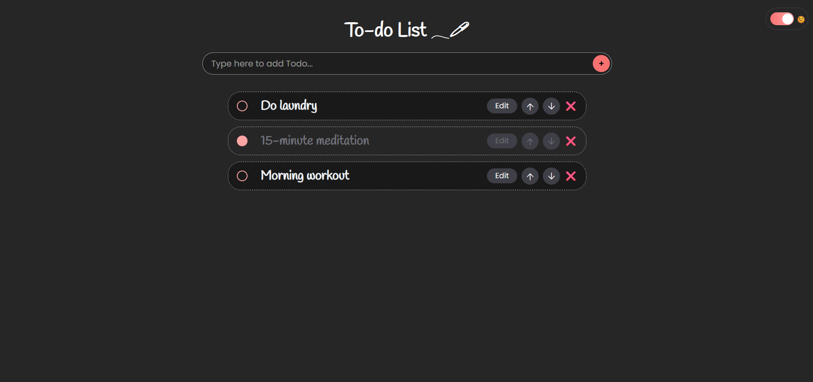

# 📝 React Todo

A simple and beautiful **Todo Application** built using **React + Vite**, **Tailwind CSS**, and **Local Storage**.  
This supports **Dark/Light themes**, editing todos, marking as completed, reordering items, and deleting todos.

---

## 🌟 Features

### ✔️ Core Features

- Add new todos
- Edit existing todos
- Delete todos
- Mark todos as completed
- Move todos **up & down**
- Stores everything in **localStorage** (your data never disappears)

### 🎨 UI Features

- Fully responsive clean UI
- **Dark mode + Light mode** (toggle anytime)
- Smooth modern design using Tailwind CSS
- Rounded card-style todo items

---

## 🚀 Tech Stack

| Technology            | Usage                           |
| --------------------- | ------------------------------- |
| **React + Vite**      | UI, Components, Fast Dev Server |
| **Tailwind CSS**      | Styling                         |
| **Context API**       | Global State Management         |
| **LocalStorage**      | Data Persistence                |
| **JavaScript (ES6+)** | Logic                           |

---

## 📸 Screenshots

### 🌞 Light Mode



### 🌙 Dark Mode



---

## 🔧 Run Locally

### 1. Clone the project

```bash
git clone https://github.com/minuyuhansi/TODO-React.git
```
